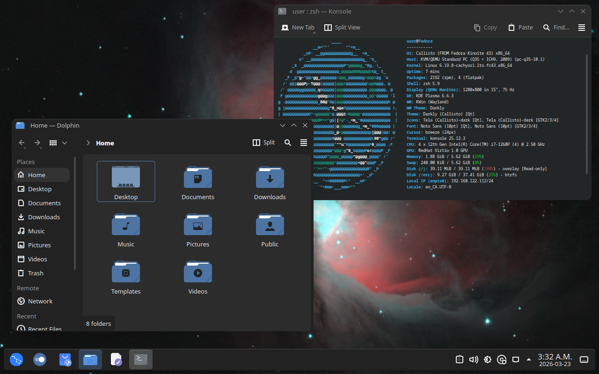
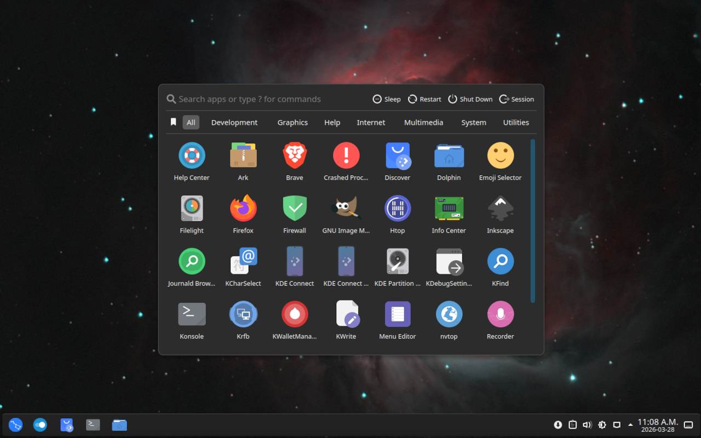

<header>
    <div align="center">
        <picture>
            <!-- Source for viewports 900px and wider -->
            <source media="(min-width: 600px)" srcset="readme\banner.jpg" style="width: 100%">
            <!-- Fallback/default image (for screens less than 600px or unsupported browsers) -->
            
        </picture>
    </div>
    <div align="center" style="padding: 16px;">
        
    </div>
</header>
<hr>

Callisto is a galaxy themed Fedora-based image, designed to be frictionless and enjoyable for most people running modern Intel/AMD systems. Callisto runs a custom theme composing of multiple different community projects. Callisto aims to feel a lot like how Windows *should* feel without any of the poor design choices.

**Why would you install Callisto?**
- You really enjoy astrophotography.
- You want an OS that *looks* and *feels* great out of the box.
- Built as an atomic distribution, this makes it very difficult to break your system.
- Improved kernel scheduling for a more responsive system.
- Better ram management than stock Fedora.
- Increased hardware support over stock Fedora.
- Includes a small list of QOL improvements.

**Table of Contents**
- [Screenshots](#screenshots)
- [Specifications](#specifications)
- [Installation instructions](#installation-instructions)
  - [From Fedora Base](#from-fedora-base)
  - [From ISO](#from-iso)
- [Build your own ISO](#build-your-own-iso)

## Screenshots

<details open>
    <summary>Desktop</summary>
    <div align="center">
        
    </div>
</details>
<details>
    <summary>App Launcher</summary>
    <div align="center">
        
    </div>
</details>

## Specifications

| Category | Feature | Description | Notes |
|----------|---------|-------------|:------|
| OS       |         |             |       |
|          | Base Image | [Fedora Kinoite](https://fedoraproject.org/atomic-desktops/kinoite/) | An official Fedora KDE Plasma distribution. |
| Look & Feel |      |             |       |
|          | Environment | [KDE Plasma](https://kde.org/plasma-desktop/) | A simple, powerful, and very configurable desktop environment.   |
|          | Theme   | [Darkly Theme](https://github.com/Bali10050/Darkly/) | Makes Plasma look a lot more modern. |
|          | Icons   | [Tela Icon Theme](https://github.com/vinceliuice/Tela-icon-theme) | Flat design icons which look great paired with the Darkly theme. |
|          | App Launcher | [AppGrid Application Launcher](https://github.com/xarbit/plasma6-applet-appgrid) | Pop-OS Cosmic-style app launcher optimized for search and every-day app launching. |
| Kernel, Hardware, and Performance | | |  |
|          | Base    | [CachyOS LTO](https://copr.fedorainfracloud.org/coprs/bieszczaders/kernel-cachyos-lto/) | Increases performance on modern CPUs, the CachyOS kernel is compiled using newer instruction sets. It also provides the BORE scheduler that increases system responsiveness. Compiled with Clang using link time optimization, which also can increase performance.|
|          | Settings | [CachyOS and KSM Settings](https://copr.fedorainfracloud.org/coprs/bieszczaders/kernel-cachyos-addons/) | Low-latency sysctl tweaks, hardware-specific udev rules, and performance-oriented environment configurations to maximize the efficiency of CachyOS kernels and modern CPU architectures. Enables zram paging and reduces RAM usage via memory deduplication.|
|          | Userspace Process Optimization| [System76 Scheduler](https://copr.fedorainfracloud.org/coprs/kylegospo/system76-scheduler/) | Assigns process priorities for improved desktop responsiveness. Foreground processes and their sub-processes will be given higher process priority.|
|          |         | [System76 Scheduler KWin Integration](https://github.com/maxiberta/kwin-system76-scheduler-integration) | Informs the System76 Scheduler on foreground processes in Plasma. |
|          | Hardware Support | [Ublue akmods](https://copr.fedorainfracloud.org/coprs/ublue-os/akmods/) | |
|          | Firmware | [Ublue-os non-free firmware](https://github.com/ublue-os/bazzite-firmware-nonfree) | |
| Packages |         |             |       |
|          | Multimedia | Non-free multimedia packages | |
|          | Default Apps | A small number common default apps | |
|          | Custom Apps | Custom applications like [WebappManager](./build_files/files/usr/lib/WebappManager/) | |
| Repositories ||||
|          | Flathub | [Flathub Repository](https://flathub.org/en) | |
|          | Fedora Flatpak | Fedora default flatpak repository | |
| Terminal ||||
|          | Shell | [Zsh](https://www.zsh.org/) | |

## Installation instructions

### From Fedora Base
Install any atomic [Fedora distribution](https://www.fedoraproject.org/atomic-desktops/) (Kinoite is recommended) and then run: 

```sh
rpm-ostree rebase ostree-image-signed:docker://ghcr.io/qkmaxware/callisto:main
```

> [!WARNING]  
> Do not rebase to callisto:latest. The latest image tag includes unstable images for testing. The stable tag is callisto:main.


### From ISO

[Build an ISO](#build-your-own-iso) as described below.

Using [Rufus](https://rufus.ie/en/), [Balena Etcher](https://etcher.balena.io/), [Fedora Media Writer](https://fedoraproject.org/workstation/download/#fedora-media-writer), or another bootable ISO writer flash the image to an empty USB drive. 

Boot your PC into your boot menu by tapping the boot key when you see the bios logo (often F12 but check your specific brand's settings). Select the USB drive from the list of devices. 

> [!WARNING]  
> If you do not see the USB drive on your list of bootable devices check your bios settings (instructions vary per manufacturer) to see if it allows boot from USB and verify that your media writer completed successfully.

Your PC will boot into the installer automatically. Simply follow the steps to install the operating system on your computer. 

## Build your own ISO

ISOs of this Fedora-based image can be created by using [JasonN3's](https://github.com/JasonN3) [build-container-installer](https://github.com/JasonN3/build-container-installer) project. 

Ensure podman is installed and run the following command:

> [!NOTE]  
> Docker can also work instead of podman, but podman is preferred. If using docker you should be able to just replace the "podman" part of the command with "docker" without changing anything else.

```
sudo podman run --rm --privileged --volume .:/build-container-installer/build ghcr.io/jasonn3/build-container-installer:latest -e IMAGE_REPO=ghcr.io/qkmaxware -e IMAGE_NAME=callisto -e IMAGE_TAG=main -e VERSION=43 -e VARIANT=Kinoite -e EXTRA_BOOT_PARAMS=inst.lang=en_CA.UTF-8 -e ISO_NAME=build/callisto.iso
```

The above command will use the build-container-installer project to build the latest stable image version of Callisto. It will output an ISO file and a checksum for the ISO in the current working directory.  

> [!NOTE]  
> If you are on Windows rather than Linux when building the ISO simply remove the "sudo" part of the command as Windows doesn't require that for running a privileged container. 


<hr>
<div align="center">
    
</div>