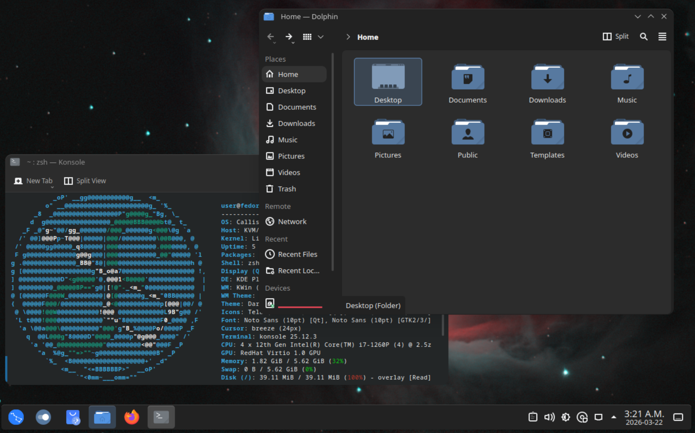

<div align="center">
    
    <h1>Callisto</h1>
</div>

Callisto is a galaxy themed Fedora-based image, designed to be enjoyable and frictionless for most people running modern Intel and AMD systems. Why would you install Callisto?

- You really enjoy astrophotography.
- Built as an atomic distribution, this makes it very difficult to break your system.
- Improved kernel scheduling for a more responsive system.
- Better ram management than stock Fedora.
- Default KDE Plasma looks a bit outdated. This image ships a modern dark mode theme by default.
- Increased hardware support over stock Fedora.
- Includes a small list of QOL improvements.

## Screenshot

<div align="center">
    
</div>


## Specifications

| Component | Feature | Description |
|-----------|---------|-------------|
| OS        |||
|           | Base Image   | quay.io/fedora-ostree-desktops/kinoite:43 |
| Desktop   |||
|           | Environment | KDE Plasma |
|           | Theme   | [Darkly Theme](https://github.com/Bali10050/Darkly/) |
| Kernel    |||
|           | Base    | [CachyOS LTO](https://copr.fedorainfracloud.org/coprs/bieszczaders/kernel-cachyos-lto/) |
|           | Settings | [CachyOS and KSM](https://copr.fedorainfracloud.org/coprs/bieszczaders/kernel-cachyos-addons/) |
|           | Hardware Support | [Ublue akmods](https://copr.fedorainfracloud.org/coprs/ublue-os/akmods/) |
|           | Firmware | [Ublue-os non-free firmware](https://github.com/ublue-os/bazzite-firmware-nonfree)
| Packages  |||
|           | Multimedia | Non-free multimedia packages |
|           | Default Apps | A small number common default apps |
|           | Custom Apps | Custom applications like [WebappManager](./build_files/files/usr/lib/WebappManager/) |
| Repositories ||| 
|           | Flathub | [Flathub Repository](https://flathub.org/en) |
|           | Fedora Flatpak | Fedora default flatpak repository |
| Terminal  |||
|           | Shell | [Zsh](https://www.zsh.org/) |

## Installation instructions

Install any atomic Fedora distribution (Kinoite is recommended) and then run: 
```sh
rpm-ostree rebase ostree-image-signed:docker://ghcr.io/qkmaxware/callisto
```

**OR** 

[Build an ISO](#build-your-own-iso) as described below, flash it to a USB device and install it as per the normal linux install process. 

## Build your own ISO

Ensure podman is installed and run the following command:

```
sudo podman run --rm --privileged --volume .:/build-container-installer/build ghcr.io/jasonn3/build-container-installer:latest -e IMAGE_REPO=ghcr.io/qkmaxware -e IMAGE_NAME=callisto -e IMAGE_TAG=latest -e VERSION=43 -e VARIANT=Kinoite -e EXTRA_BOOT_PARAMS=inst.lang=en_CA.UTF-8 -e ISO_NAME=build/callisto.iso
```

If using Docker instead of Podman simply replace `podman` in the above command with `docker`. This also works in windows without sudo.
